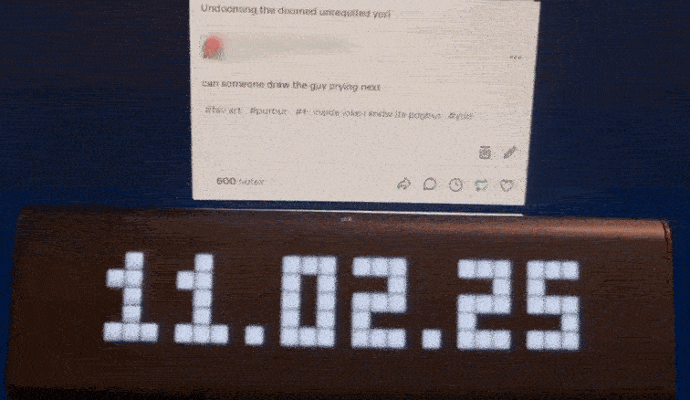
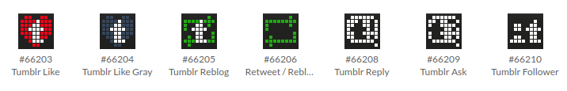

# Tumblr notifications on LaMetric TIME

I'm quite fond of Tumblr. I'm also fond of my LaMetric TIME and its pixel art display, but I don't really use it for anything. And I wanted to make some pixel art. So this is the result.

It's effectively a Node.js Discord bot that listens to Tumblr webhook messages and bridges it to the LaMetric TIME.

## Not implemented
* Notifications for when *you* post, be it original or a reblog
* Text content for asks, reblogs, and replies
* Built-in support for multiple blogs (in the meantime, you can run multiple instances of this project)
* Good documentation

## Setup and heads-up
I apologize in advance for my flimsy instructions.

You are going to need your LaMetric clock key, clock IP address, Discord bot token, a Discord channel, and maybe a Tumblr account. When I talk about "setting environment variables", I mean putting them in the .env file. Look at the .env.example file for an example of this.

### LaMetric KEYS (ha ha)
To start, check [this LaMetric Docs page](https://lametric-documentation.readthedocs.io/en/latest/guides/first-steps/first-local-notification.html#discover-ip-address) for how to get the clock IP and key. Set those as `LAMETRIC_IP` and `LAMETRIC_KEY` environment variables respectively.

### Tumblr-to-Discord webhook
If you already enabled this Tumblr feature, just set the `DISCORD_WEBHOOK` and `TUMBLR_BLOG` environment variables accordingly. If not:

Decide which blog you're going to set this up for and set its username as the `TUMBLR_BLOG` environment variable. Then in your [Tumblr Labs](https://www.tumblr.com/settings/labs) settings, you can choose to enable "Tumblr to Discord Webhooks". Once you've done that, [create a Discord webhook](https://support.discord.com/hc/en-us/articles/228383668-Intro-to-Webhooks) and set its URL as the `DISCORD_WEBHOOK` environment variable.

Go to to the settings of your Tumblr blog now and find the "Discord Notifications" section. Paste in your webhook URL and enable the notification types you'd like. If you want certain types on for the webhook but not on your LaMetric TIME, look at the customization section.

### Discord bot
Almost there! We just need a Discord bot to listen to the webhook messages. If you have one already, and it has the messages intent, set the `DISCORD_BOT_TOKEN` environment variable to its token and make sure it has access to your webhook's channel, otherwise:

Create a Discord application on the [Discord Developer Portal](https://discord.com/developers/applications) and then go to the Bot tab. Make sure to enable the "Message Content Intent" feature, otherwise this project will not work. Then go to the "General Information" tab and copy the Application ID. Then paste that ID into the client_id part of this link to invite it to your server: `https://discord.com/oauth2/authorize?client_id=YOURAPPIDHERE&permissions=0&integration_type=0&scope=bot`

Once it's in the server, make sure it has permissions to read the channel.

### Run the thing!
Simply `npm install && node index.js` and try to like one of your own posts. You should see that like appear on your LaMetric TIME with your username.

## Customization
You'll notice in the .env.example file that there are some icon variables. You can set these to the ID of any icon on the [LaMetric Icons](https://developer.lametric.com/icons) site. I've made some, which you can see below.

If you *don't* set an icon for a notification type, that notification type will not be bridged to your LaMetric TIME.

There are also sound variables. If you don't set a sound for a type, no sound will play. Refer to the [full list of notification IDs](https://lametric-documentation.readthedocs.io/en/latest/reference-docs/device-notifications.html) on the LaMetric Docs site, for simplicity you can't use custom sounds at the moment.

## Ignoring and blocking users
Some people are just too noisy or have interesting usernames. If you recognize your beloved mutual in this sentence, add them to the `MUTED_USERS` or `BLOCKED_USERS` variables, separated by comma without spaces.

Muting them prevents notification sounds from being played, while blocking them prevents any notifications they triggered from being sent at all.

## Legal disclaimer
This application doesn't actually use the Tumblr application programming interface but is still not endorsed or certified by Tumblr, Inc. All of the Tumblr logos and trademarks displayed on this application are the property of Tumblr, Inc.
