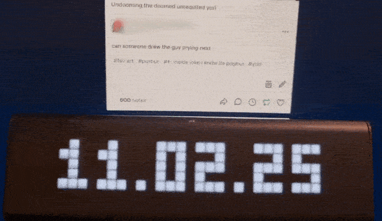
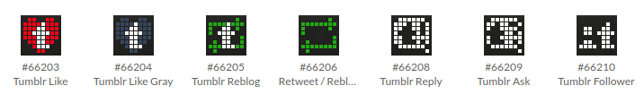

# Tumblr notifications on LaMetric TIME

I'm quite fond of Tumblr. I'm also fond of my LaMetric TIME and its pixel art display, but I don't really use it for anything. And I wanted to make some pixel art. So this is the result.

It's effectively a Node.js Discord bot that listens to Tumblr webhook messages and bridges it to the LaMetric TIME.

## Not implemented
* Notifications for when *you* post
* Text content for asks, reblogs, and replies
* Built-in support for multiple blogs (in the meantime, you can run multiple instances of this project)

## Setup

### LaMetric TIME keys
To start, check [this LaMetric Docs page](https://lametric-documentation.readthedocs.io/en/latest/guides/first-steps/first-local-notification.html#discover-ip-address) for how to get the clock IP and key. Set those as `LAMETRIC_IP` and `LAMETRIC_KEY` environment variables respectively.

### Tumblr-to-Discord webhook

Decide which blog you're going to set this up for and set its username as the `TUMBLR_BLOG` environment variable. Then in your [Tumblr Labs](https://www.tumblr.com/settings/labs) settings, you can choose to enable "Tumblr to Discord Webhooks". Once you've done that, [create a Discord webhook](https://support.discord.com/hc/en-us/articles/228383668-Intro-to-Webhooks) and set its URL as the `DISCORD_WEBHOOK` environment variable.

Go to the settings of the blog you set and scroll down to the "Discord Notifications" section. Paste in the Discord webhook URL from earlier and enable the notification types you'd like to bridge (if you want a type on the webhook but not on your LaMetric TIME, see "Setting icons and sounds".)

### Discord bot
Create a Discord application on the [Discord Developer Portal](https://discord.com/developers/applications) and then go to the Bot tab and enable "Message Content Intent" under "Privileged Gateway Intents". 

While on the bot tab, click "Reset Token" and set the token you get as the `DISCORD_BOT_TOKEN` environment variable. Then go to the "General Information" tab, copy the Application ID, and paste it into the client_id part of this link: `https://discord.com/oauth2/authorize?client_id=YOURAPPIDHERE&permissions=0&integration_type=0&scope=bot`

Invite the bot to the server with the webhook by going to that link. If you made the webhook in a private channel, make sure to give the bot read access to it.
### Setting icons and sounds
Last thing, let's customize a bit. Look at the `.env.example` file and you'll see some icon variables. These are IDs of icons on the [LaMetric Icons](https://developer.lametric.com/icons) site.

**Make sure** to set icons for the notification types you want to see on your LaMetric TIME. If you don't set an icon, that type won't bridge to the LaMetric TIME.

There are also sound variables if you want them. Refer to the [full list of notification IDs](https://lametric-documentation.readthedocs.io/en/latest/reference-docs/device-notifications.html) on the LaMetric Docs site, for simplicity you can't use custom sounds at the moment.

### Done!
Simply `npm install && node index.js`. As a quick test, if you enabled the like type in your blog settings and set a like icon, just try to like one of your own posts. You should see that like appear on your LaMetric TIME with your username.

## Filtering

### Disabling notifications from certain users
You can add users to the `BLOCKED_USERS` environment variable, separated by comma without spaces.

If the problem is just that they interact with you too much, consider `MUTED_USERS`, which only disables sounds.

## Legal disclaimer
This application doesn't actually use the Tumblr application programming interface but is still not endorsed or certified by Tumblr, Inc. All of the Tumblr logos and trademarks displayed on this application are the property of Tumblr, Inc.
